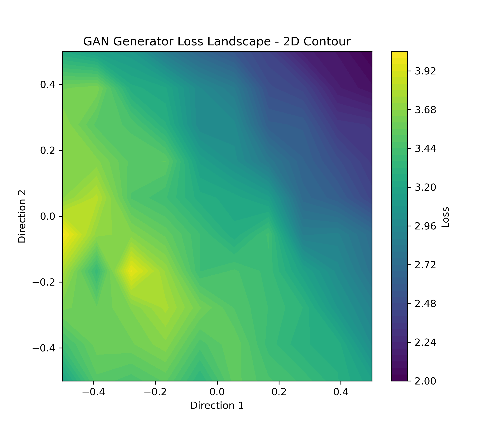
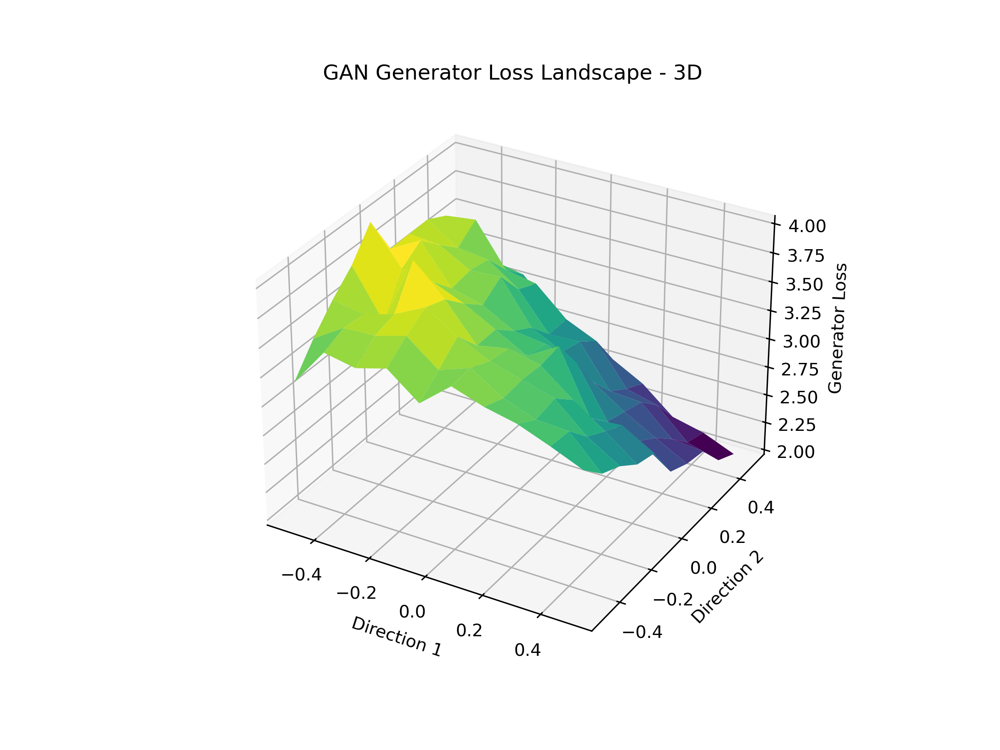
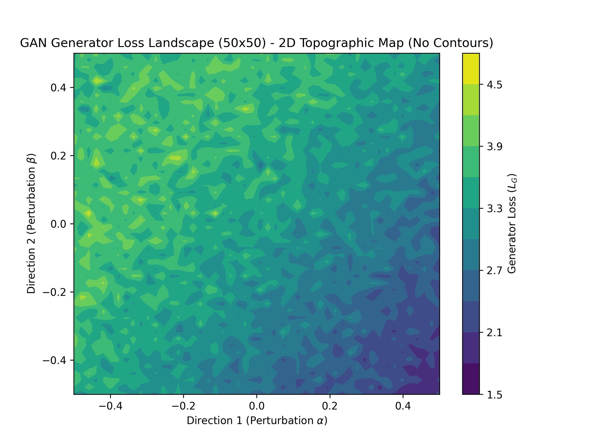
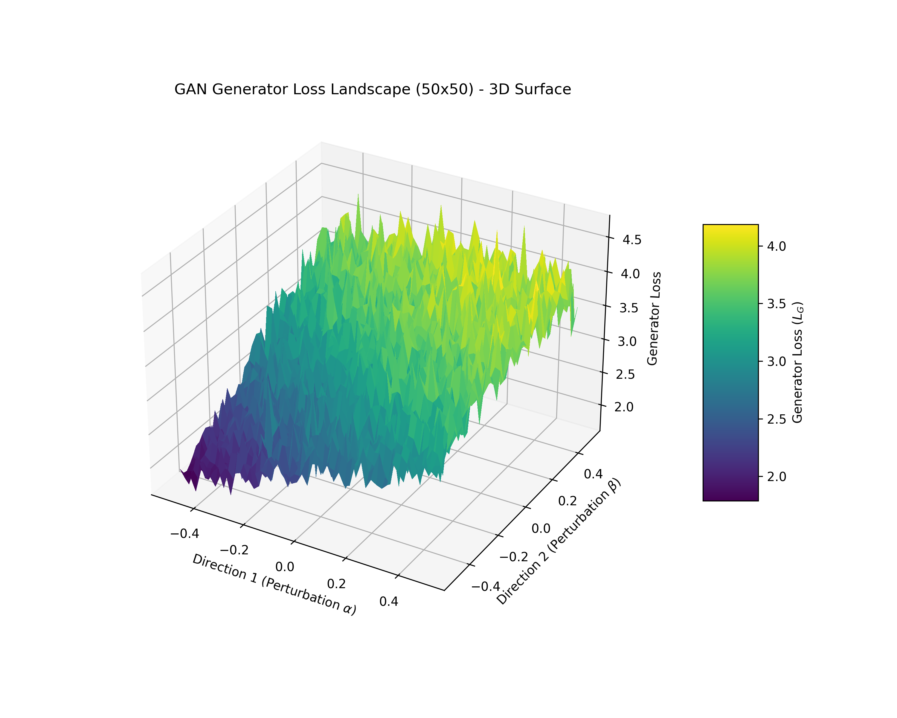
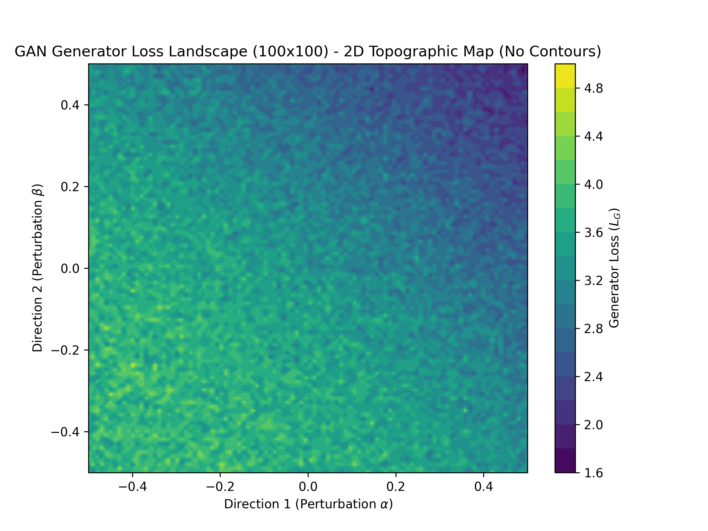
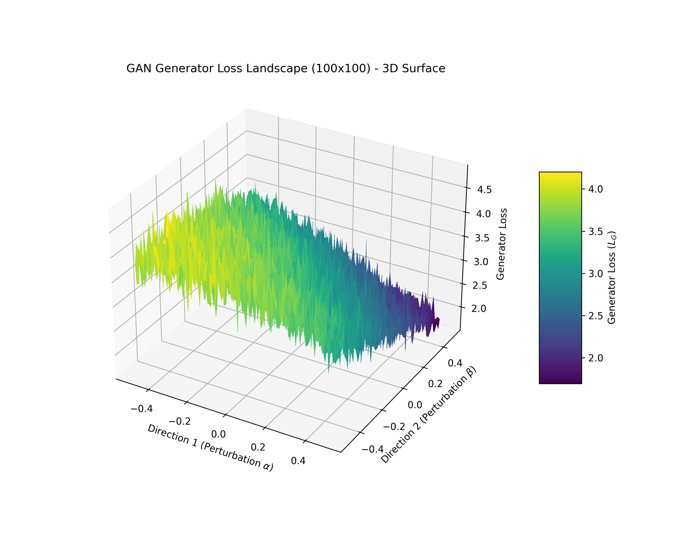
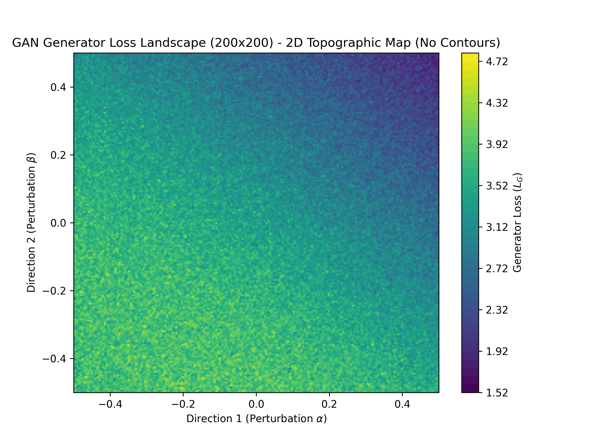
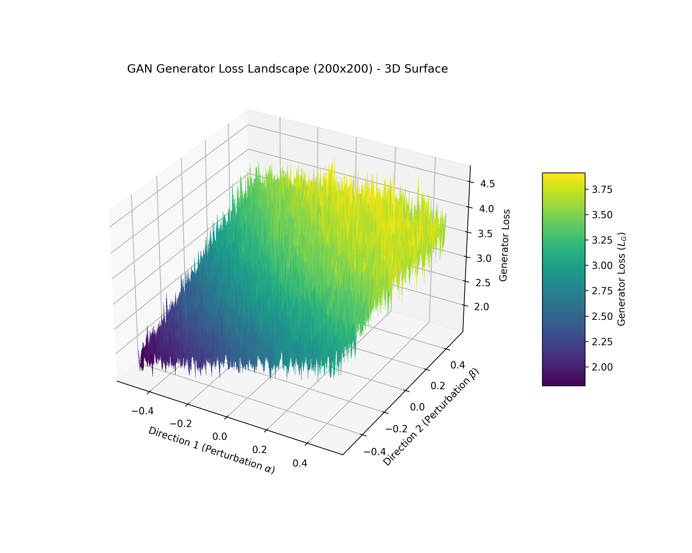

# visualizing-loss-landscape-at-different-resolutions-of-a-GAN-
This project visualizes the **loss landscape** of a trained GAN to understand how its optimization surface behaves around the learned parameters.

## What Is a Loss Landscape?

A **loss landscape** is a surface that shows how the model’s loss changes when its parameters are slightly perturbed in different directions.  
It’s like looking at the “terrain” your optimizer has to walk over — valleys, hills, and basins represent how the model learns.

- **Flat regions** → Stable minima, better generalization  
- **Sharp regions** → Sensitive minima, potential overfitting

       \(f(\alpha ,\beta )=\text{Loss}(\theta ^{*}+\alpha d_{1}+\beta d_{2})\)
where **θ** is the model’s parameters, and **α**, **β** are step sizes in two random directions (**d₁**, **d₂**).

## what does the code do?
The code visualizes the loss landscape of a GAN by slightly perturbing its learned parameters and measuring how the Generator’s loss changes. It helps you understand how “flat” or “sharp” the minima of the GAN are in parameter space, which is useful for analyzing training stability and generalization.
Loads a subset of real images for loss evaluation.
1. Loads a pretrained GAN (Generator & Discriminator).
2. Generates two random directions in parameter space for perturbation.
3. Computes the Generator loss at every point on a 2D grid (size defined by GRID_STEPS) in parameter space.
4. Creates visualizations:
   1. 2D Topographic Map
   2. 2D Heatmap
   3. 3D Surface Plot
   4. 3D Mesh Object (.PLY) for interactive exploration.
5. Allows adjustable resolution (GRID_STEPS = 10, 50, 100, etc) to see the difference between coarse and fine-grained loss landscapes.
6. Uses memory-saving techniques to perturb only the final layer and clear unused memory during computation.

## Understanding GRID_STEPS (Resolution)

The parameter `GRID_STEPS` defines how many points we sample on the loss surface.

| GRID_STEPS | Description | Computation | Visual Smoothness |
|-------------|--------------|--------------|--------------------|
| **10** | Coarse grid | Fast | Rough surface |
| **50** | Moderate grid | Slower | Smooth & detailed |
| **100** | High resolution | Heavy | Very smooth |
| **200** | Ultra fine | Very heavy | Highly detailed surface |

Increasing `GRID_STEPS` → smoother, more accurate surfaces  
But computation cost increases roughly with `GRID_STEPS²`

## Visualization Types

### 2D Contour Plot
Shows the "top-down view" of loss values — like a heatmap of valleys and peaks.  
Lower (darker) regions = smaller loss → better minima.

### 3D Surface Plot
Shows a mountain-like terrain — visually represents how loss changes in nearby parameter space.  
Helps understand if your GAN found a *flat*, *wide* minimum (good) or *sharp*, *unstable* one (bad).

## GRID_STEPS (Resolution) vs Image comparison comparison 
### For 10:
#### 2D graph of loss landscape 

#### 3D graph of loss landscape

### For 50:
#### 2D graph of loss landscape 

#### 3D graph of loss landscape

### For 100:
#### 2D graph of loss landscape 

#### 3D graph of loss landscape

### For 200:
#### 2D graph of loss landscape 

#### 3D graph of loss landscape

## How to Run
1. Clone the Repository
   
          git clone https://github.com/AravKataria/visualizing-loss-landscape-at-different-resolutions-of-a-GAN-.git
          cd visualizing-loss-landscape-at-different-resolutions-of-a-GAN-
2. Install requirements

            pip install -r requirements.txt
3. Prepare Your Files
   Generator checkpoint: generator.pth
   Discriminator checkpoint: discriminator.pth
   Images folder: Folder with real images for evaluation
4. Set the Resolution

         GRID_STEPS = 11   # Fast, coarse grid
         GRID_STEPS = 50   # Moderate grid (recommended)
         GRID_STEPS = 100  # High-resolution, slower
         GRID_STEPS = 200  # highest-resolution, very slow
5. Run the Script
   
         python visualize_loss_landscape.py
